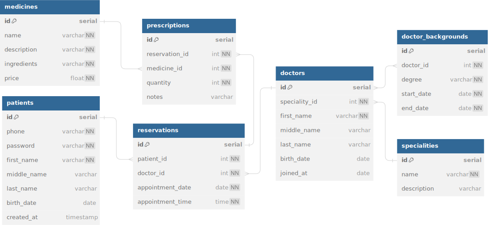

# Readme

## Task

1. Design Schema for the following:
List of Patients, each patient can do a reservation for a consultation, the reservation is based on the clinic slot/schedule
patient will get the queueing number

2. Architecture Test:
using python with Fastapi framework.
Based on your schema, write CRUD APIs for the patient reservation case

You can either submit
the Github link or zip folder. Write any assumptions that you have in README.md

Some things that we’d like to see on the project:

- Explanation of your project structure or design pattern that you implement
- Short manual to run the application (+ with docker, a must if you are not using python with fastapi framework)
- API documentation. You can choose any format you like
including README.md

## Schema



## Solution

### Analysis

Approaching this simple backend problem using FastAPI with 5 days deadline is a unique challenge for me, as my background was building REST services using Go.

The schema I build includes prescriptions and medicines table (although not yet implemented) gives a sense of scalability if needed in the future.

With basic knowledge of Python and lots of research, I managed to complete this technical test in 5 days. Using a relational database (this case Postgres) is the best solution for this kind of scenarios. Each data can be stored atomically and is scalable if another table needed a foreign key to hold on.

JWT is used as an authorization for the patient to book an appointment / to be used on other endpoints that needs a user credentials. There is also an endpoint to get all the doctors that does not need a JWT header embedded with the request, so the patient can look at the list of doctors without logging in.

### Room of Improvements

- Using dependency injection (DI) can be beneficial if the complexity gets higher. Using Go before, I have always implemented dependency injection (i.e. using an interface between controller and repository). With limited time on this project, there's not enough resources for me to implement DI on this project.

- If this application wants to be scalable on high scale, It can be beneficial to make it as a microservices, rather than a monolith like what it is right now. It can also be beneficial to implement caching (such as Redis) for looking up doctors list only if the traffic is high enough to benefit from using Redis.

- Since this is my first time using a Python to build REST APIs, I think it can be beneficial to use ORM for scalability in the future. But with the limited timespan for this project and the small scale of the project, it's still managable without ORM. 

- It can also be beneficial to use error contracts for scalability in the future.

- If I can rewrite this application with Go, I think I can do it more concise and cleaner, since I have had the experience making multiple REST APIs with Go.

## Instruction

## Docker Compose

Change directory to `./technical-test`, then insert command:

```bash
docker-compose up
```

> Make sure to close your local Postgres service, otherwise the port (5432) will be blocked

After it has finished, you may find that the FastAPI service stopped. This is to be expected since the FastAPI service could be finished first before the Postgres service is ready to serve. To solve this problem, just go to the Docker GUI and restart the `clinic-service`

You can find the documentation on http://0.0.0.0:8000/docs

### Create and Populate the Database

After the docker compose has completed, please open a connection to the Postgres (I recommend use TablePlus) with the following credentials:

- host = localhost
- user = postgres
- password = secret
- port = 5432
- database = zicare

After the connection has been established, please add the queries below to create and populate the database. Feel free to add more datas!

#### Create Tables and Relationships

Insert the following command to create a new tables with its relationships

```sql
CREATE TABLE IF NOT EXISTS patients (
    id SERIAL PRIMARY KEY,
    phone VARCHAR(50) UNIQUE NOT NULL,
    password VARCHAR(100) NOT NULL,
    first_name VARCHAR(255) NOT NULL,
    middle_name VARCHAR(255),
    last_name VARCHAR(255),
    birth_date DATE NOT NULL,
    created_at TIMESTAMP WITH TIME ZONE DEFAULT CURRENT_TIMESTAMP
);

CREATE TABLE IF NOT EXISTS specialities (
    id SERIAL PRIMARY KEY,
    name VARCHAR(50) NOT NULL,
    description VARCHAR(255)
);

CREATE TABLE IF NOT EXISTS doctors (
    id SERIAL PRIMARY KEY,
    speciality_id INT NOT NULL,
    first_name VARCHAR(255) NOT NULL,
    middle_name VARCHAR(255),
    last_name VARCHAR(255),
    birth_date DATE NOT NULL,
    joined_at DATE NOT NULL,
    FOREIGN KEY(speciality_id) REFERENCES specialities(id)
);

CREATE TABLE IF NOT EXISTS doctor_backgrounds (
    id SERIAL PRIMARY KEY,
    doctor_id INT NOT NULL,
    degree VARCHAR(50) NOT NULL,
    start_date DATE NOT NULL,
    end_date DATE NOT NULL,
    FOREIGN KEY(doctor_id) REFERENCES doctors(id)
);

CREATE TABLE IF NOT EXISTS reservations (
    id SERIAL PRIMARY KEY,
    patient_id INT NOT NULL,
    doctor_id INT NOT NULL,
    appointment_date DATE NOT NULL,
    appointment_time TIME NOT NULL,
    FOREIGN KEY(patient_id) REFERENCES patients(id),
    FOREIGN KEY(doctor_id) REFERENCES doctors(id)
);

CREATE TABLE IF NOT EXISTS medicines (
    id SERIAL PRIMARY KEY,
    name VARCHAR(100) NOT NULL,
    description VARCHAR(255) NOT NULL,
    ingredients VARCHAR(255) NOT NULL,
    price FLOAT NOT NULL
);

CREATE TABLE IF NOT EXISTS prescriptions (
    id SERIAL PRIMARY KEY,
    reservation_id INT NOT NULL,
    medicine_id INT NOT NULL,
    quantity INT NOT NULL,
    notes VARCHAR(255),
    FOREIGN KEY(reservation_id) REFERENCES reservations(id),
    FOREIGN KEY(medicine_id) REFERENCES medicines(id)
);
```

#### Populate the Database

Insert the following commands to populate the doctors and their backgrounds.

```sql
INSERT INTO specialities (name, description) 
VALUES 
    ('Sp. THT', 'Telinga, hidung, dan tenggorokan'), 
    ('Sp. Anak', 'Kesehatan anak');

INSERT INTO doctors (speciality_id, first_name, middle_name, last_name, birth_date, joined_at)
VALUES
    (1, 'Foo', 'Bar', 'Baz', '1970-01-01', '2020-01-01'),
    (2, 'Nirina', 'Raudhatul', 'Zubir', '1980-03-12', '2019-01-01'); 
```

### Usage

After populating the database, you can use the services with Postman, or using Swagger based on http://0.0.0.0:8000/docs